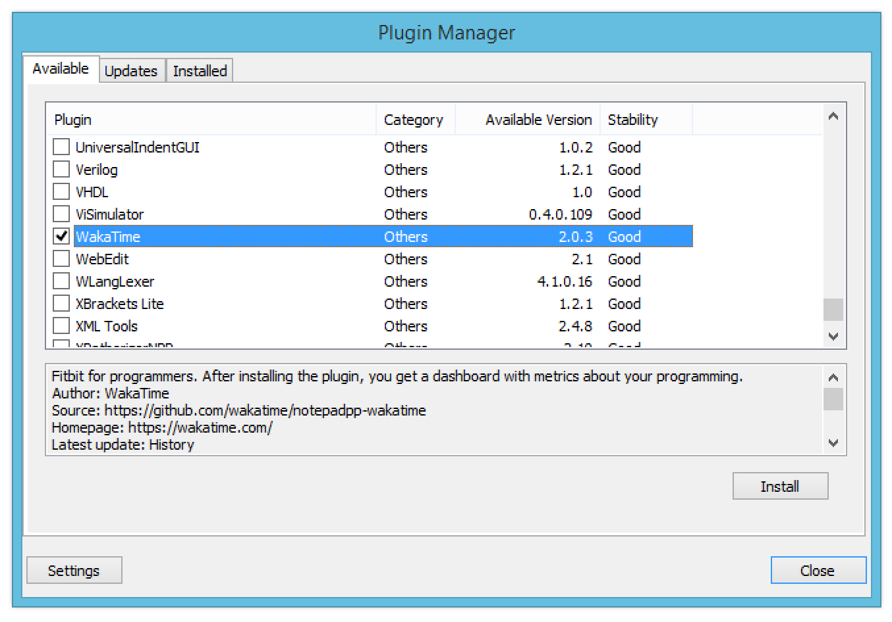

notepadpp-wakatime
=====================

Metrics, insights, and time tracking automatically generated from your programming activity.

Installation
------------

1. Inside Notepad++ open the Plugin Manager (`Plugins` -> `Plugin Manager` -> `Show Plugin Manager`).

2. Check the box next to `WakaTime` in the list of plugins.

3. Click the `Install` button.

4. Restart Notepad++.

3. Enter your [api key](https://wakatime.com/settings#apikey), then press `enter`.

4. Use Notepad++ like you normally do and your time will be tracked for you automatically.

5. Visit https://wakatime.com to see your logged time.

Screen Shots
------------

Troubleshooting
---------------

WakaTime for Notepad++ logs to `C:\Users\<user>\AppData\Roaming\Notepad++\plugins\config\WakaTime.log`.

Turn on debug mode (click the WakaTime icon in Notepad++) then check your log file.

WakaTime Core logs to `C:\Users\<user>\.wakatime.log`. Check there after looking in your Notepad++ WakaTime.log file.

More help can be found at https://github.com/wakatime/wakatime#troubleshooting.
